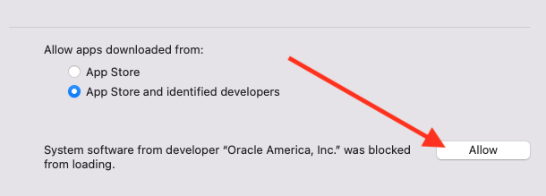

Below are abbreviated instructions to get a local virtual routing lab setup. We will use Virtualbox, Vagrant and FRR.


## Versions
Software | Version
--- | ---
Mac | 12.0.1 (Monterey)
Xcode | 13.1
Homebrew | 3.3.6


## Instructions
1. Install [Xcode](https://apps.apple.com/us/app/xcode/id497799835?ls=1&mt=12)
2. Install [Homebrew](https://brew.sh)
```
/bin/bash -c "$(curl -fsSL https://raw.githubusercontent.com/Homebrew/install/HEAD/install.sh)""
```
* Hint look for any messages regarding accepting Xcode license agreement.
3. Install [Vagrant](https://www.vagrantup.com/downloads)
```
brew install vagrant
```
4. Install [VirtualBox](https://formulae.brew.sh/cask/virtualbox)
```
brew install --cask virtualbox
```
* Hint: If the installation fails, retry after you enable it in:
    System Preferences → Security & Privacy → General



5.
