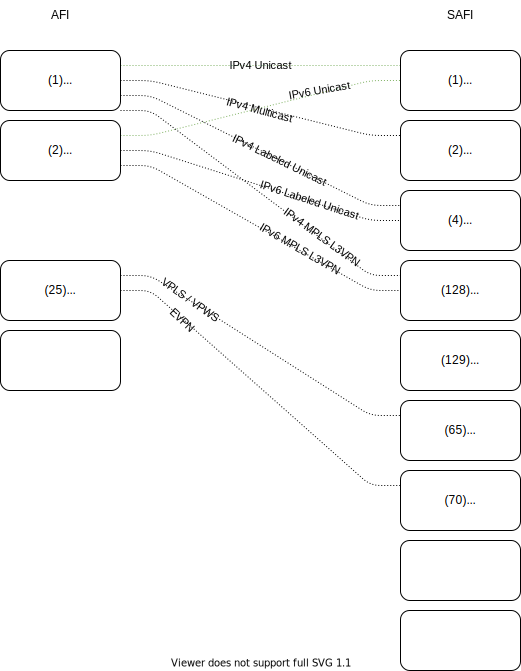

Today we will attempt to simplify understanding of the various MP-BGP types. We will discuss various acronyms, address families and modifiers.
<!-- more -->

## Definitions
Acronym | Phrase | Usage
--- | --- | ---
[VRF](https://en.wikipedia.org/wiki/Virtual_routing_and_forwarding) | Virtual routing and forwarding | Multiple virtual routers with unique address space
[MP-BGP](https://en.wikipedia.org/wiki/Multiprotocol_BGP) | Multiprotocol Extensions for BGP | Allows for different types of address families to be distributed.
[AFI](https://www.iana.org/assignments/address-family-numbers/address-family-numbers.xhtml) | Address Family Numbers | ?
[SAFI](https://www.iana.org/assignments/safi-namespace/safi-namespace.xhtml) | Subsequent Address Family Identifiers | ?
NLRI | Network Layer Reachability Information | Destination information. For example, IP + mask.
RD | Route Distinguisher | Used to identify which VRF a route belongs.
RT | Route Target | BGP extended community attribute used to define import and exports.


## Table
### Address family

Number | Description
--- | ---
1 | IPv4
2 | IPv6
11 | IPX
12 | AppleTalk
25 | L2VPN


Cisco IOS:
```
(config-router)#address-family ?
  ipv4        Address family
  ipv6        Address family
  l2vpn       Address family
  link-state  Address family
  nsap        Address family
  rtfilter    Address family
  vpnv4       Address family
  vpnv6       Address family
```

### Address Family Modifier

Number | Description
--- | ---
1 | Unicast (U)
2 | Multicast
4 | MPLS Labels (L)
65 | VPLS
70 | EVPN
128 | MPLS VPN (L3VPN / VPN)
129 | Multicast VPN

Cisco IPv4:
```
(config-router)#address-family ipv4 ?
  flowspec   Address Family modifier
  mdt        Address Family modifier
  multicast  Address Family modifier
  mvpn       Address Family modifier
  unicast    Address Family modifier
  vrf        Specify parameters for a VPN Routing/Forwarding instance
```

Cisco L2VPN:
```
(config-router)#address-family l2vpn ?
  evpn  Address Family modifier
  vpls  Address Family modifier
```

Cisco VPNv4:
```
(config-router)#address-family vpnv4 ?
  flowspec   Address Family modifier
  multicast  Address Family modifier
  unicast    Address Family Modifier
```

## IP Unicast Family
Basic internet routing. Interchangeable with BGP-4.

AFI | SAFI | Name
--- | --- | ---
1 (IPv4) | 1 (Unicast) | IPv4 Unicast
2 (IPv6) | 1 (Unicast) | IPv6 Unicast
1 (IPv4) | 2 (Multicast) | IPv4 Multicast
2 (IPv6) | 2 (Multicast) | IPv6 Multicast


Topology Example:


Cisco Configuration Example:

```
r1#
router bgp 100
 neighbor 192.168.12.2 remote-as 200
 !
 address-family ipv4
  network 1.1.1.1 mask 255.255.255.255
  neighbor 192.168.12.2 activate
 exit-address-family
```

```
#r2
router bgp 200
 neighbor 192.168.12.1 remote-as 100
 !
 address-family ipv4
  network 2.2.2.2 mask 255.255.255.255
  neighbor 192.168.12.1 activate
 exit-address-family
```

Packet Capture:

```
Border Gateway Protocol - UPDATE Message
    Marker: ffffffffffffffffffffffffffffffff
    Length: 55
    Type: UPDATE Message (2)
    Withdrawn Routes Length: 0
    Total Path Attribute Length: 27
    Path attributes
        Path Attribute - ORIGIN: IGP
        Path Attribute - AS_PATH: 100
        Path Attribute - NEXT_HOP: 192.168.12.1
        Path Attribute - MULTI_EXIT_DISC: 0
    Network Layer Reachability Information (NLRI)
        1.1.1.1/32
            NLRI prefix length: 32
            NLRI prefix: 1.1.1.1
```

## IP L3VPN Family
BGP L3VPN is used to exchange VPN (VRF) routes. Also called VPNv4 and VPNv6.

AFI | SAFI | Name
--- | --- | ---
1 (IPv4) | 128 (Labeled VPN Unicast) | IPv4 L3VPN Unicast (VPNv4)
2 (IPv6) | 128 (Labeled VPN Unicast) | IPv4 L3VPN Unicast (VPNv6)
1 (IPv4) | 129 (Labeled VPN Multicast) | IPv4 L3VPN Multicast
2 (IPv6) | 129 (Labeled VPN Multicast) | IPv6 L3VPN Multicast


Topology Example:


Cisco Configuration Example:

```
#r1
router bgp 100
 neighbor 192.168.12.2 remote-as 100
 !
 address-family vpnv4
  neighbor 192.168.12.2 activate
  neighbor 192.168.12.2 send-community extended
 exit-address-family
 !
 address-family ipv4 vrf customer
  network 11.11.11.11 mask 255.255.255.255
 exit-address-family
```

```
#r2
router bgp 100
 neighbor 192.168.12.1 remote-as 100
 !
 address-family vpnv4
  neighbor 192.168.12.1 activate
  neighbor 192.168.12.1 send-community extended
 exit-address-family
 !
 address-family ipv4 vrf customer
  network 22.22.22.22 mask 255.255.255.255
 exit-address-family
```

Packet Capture:

```
Border Gateway Protocol - UPDATE Message
    Marker: ffffffffffffffffffffffffffffffff
    Length: 91
    Type: UPDATE Message (2)
    Withdrawn Routes Length: 0
    Total Path Attribute Length: 68
    Path attributes
        Path Attribute - MP_REACH_NLRI
            Flags: 0x80, Optional, Non-transitive, Complete
            Type Code: MP_REACH_NLRI (14)
            Length: 33
            Address family identifier (AFI): IPv4 (1)
            Subsequent address family identifier (SAFI): Labeled VPN Unicast (128)
            Next hop:  RD=0:0 IPv4=192.168.12.1
            Number of Subnetwork points of attachment (SNPA): 0
            Network Layer Reachability Information (NLRI)
                BGP Prefix
                    Prefix Length: 120
                    Label Stack: 16 (bottom)
                    Route Distinguisher: 100:1
                    MP Reach NLRI IPv4 prefix: 11.11.11.11
        Path Attribute - ORIGIN: IGP
        Path Attribute - AS_PATH: empty
        Path Attribute - MULTI_EXIT_DISC: 0
        Path Attribute - LOCAL_PREF: 100
        Path Attribute - EXTENDED_COMMUNITIES
            Flags: 0xc0, Optional, Transitive, Complete
            Type Code: EXTENDED_COMMUNITIES (16)
            Length: 8
            Carried extended communities: (1 community)
                Route Target: 100:1 [Transitive 2-Octet AS-Specific]
                    Type: Transitive 2-Octet AS-Specific (0x00)
                    Subtype (AS2): Route Target (0x02)
                    2-Octet AS: 100
                    4-Octet AN: 1
```

## EVPN Family
MPLS-Based Ethernet VPN (BGP EVPN) can provide L2VPN services such as data-center interconnection (DCI). Designed as an alternative for VPLS.

IP tunneling such as Virtual Extensible LAN protocol (VXLAN) can provide L2 and L3 overlay networks with EVPN. (VXLAN BGP EVPN)

EVPN Virtual Private Wire Service (EVPN VPWS)

AFI | SAFI | Name
--- | --- | ---
25 (L2VPN) | 70 (EVPN) | VPN EVPN BGP


Topology Example:


Cisco Configuration Example:

```
#r1

```

```
#r2

```

Packet Capture:

```
Border Gateway Protocol - UPDATE Message

```

## IP Labeled Unicast Family
BGP-LU used to distribute a MPLS label mapped to a route. Not available on IOSv image. Allows for sending IP Unicast routes with MPLS tag information.

AFI | SAFI | Name
--- | --- | ---
1 (IPv4) | 4 (Labeled Unicast) | IPv4 Labeled Unicast
2 (IPv6) | 4 (Labeled Unicast) | IPv6 Labeled Unicast

Cisco Configuration Example:

```
router bgp 1
  address-family ipv4 labeled-unicast
```

## Visual Combinations



## Sources
* [Juniper - Understanding MBGP Address Families](https://www.juniper.net/documentation/en_US/junose15.1/topics/concept/mbgp-address-families-overview.html)
* [IANA - Address Family Numbers](https://www.iana.org/assignments/address-family-numbers/address-family-numbers.xhtml)
* [IANA - Subsequent Address Family Identifiers (SAFI) Parameters](https://www.iana.org/assignments/safi-namespace/safi-namespace.xhtml)
* [OpenDaylight - BGP User Guide](https://docs.opendaylight.org/projects/bgpcep/en/latest/bgp/index.html#bgp-user-guide)
* [Indeni - VXLAN with MP-BGP EVPN control plane](https://indeni.com/blog/vxlan-with-mp-bgp-evpn-control-plane/)
* [Cisco - VXLAN Lab](http://dc.ciscolive.com/pod0/labs/lab1/lab1-m1)


---
## TODO:
- [x] Unicast IPv4
- [ ] Unicast IPv6
- [ ] Multicast IPv4
- [ ] Multicast IPv6
- [x] VPN IPv4
- [ ] VPN IPv6
- [ ] L2VPN
- [ ] Route-target
- [ ] VPLS
- [ ] VPWS
- [ ] xconnect
- [ ] pseudowire


- [x] IP Unicast Family
- [ ] IP Labeled Unicast Family
- [x] IP L3VPN Family
- [ ] Link-State Family
- [ ] Flow Specification Family
- [ ] MCAST-VPN Family
- [ ] EVPN Family
- [ ] Route Target Constrain Family
- [ ] VPLS ?
