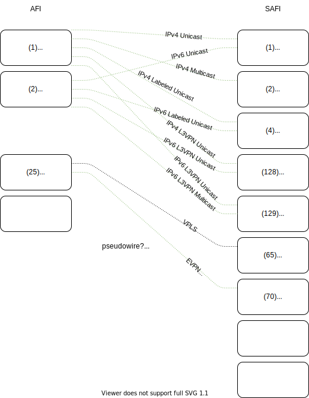

Below is an attempt to simplify understanding of the various MP-BGP types. We will discuss various acronyms, address families and modifiers.

## Definitions
Acronym | Phrase | Usage
--- | --- | ---
[VRF](https://en.wikipedia.org/wiki/Virtual_routing_and_forwarding) | Virtual routing and forwarding | Multiple virtual routers with unique address space
[MP-BGP](https://en.wikipedia.org/wiki/Multiprotocol_BGP) | Multiprotocol Extensions for BGP | Allows for different types of address families to be distributed.
[AFI](https://www.iana.org/assignments/address-family-numbers/address-family-numbers.xhtml) | Address Family Numbers | ?
[SAFI](https://www.iana.org/assignments/safi-namespace/safi-namespace.xhtml) | Subsequent Address Family Identifiers | ?
NLRI | Network Layer Reachability Information | Destination information. For example, IP + mask.
RD | Route descriptor | ?
RT | Route target | ?


## Table
### Address family

Number | Description
--- | ---
1 | IPv4
2 | IPv6
11 | IPX
12 | AppleTalk
25 | L2VPN
? | Link-State
? | NSAP
? | RTFilter
? | VPNv4
? | VPNv6

Cisco IOS:
```
(config-router)#address-family ?
  ipv4        Address family
  ipv6        Address family
  l2vpn       Address family
  link-state  Address family
  nsap        Address family
  rtfilter    Address family
  vpnv4       Address family
  vpnv6       Address family
```

### Address Family Modifier

Number | Description
--- | ---
1 | Unicast (U)
2 | Multicast
4 | MPLS Labels (L)
65 | VPLS
70 | EVPNs
128 | MPLS VPN (L3VPN)
129 | Multicast VPN

Cisco IPv4:
```
(config-router)#address-family ipv4 ?
  flowspec   Address Family modifier
  mdt        Address Family modifier
  multicast  Address Family modifier
  mvpn       Address Family modifier
  unicast    Address Family modifier
  vrf        Specify parameters for a VPN Routing/Forwarding instance
```

Cisco L2VPN:
```
(config-router)#address-family l2vpn ?
  evpn  Address Family modifier
  vpls  Address Family modifier
```

Cisco VPNv4:
```
(config-router)#address-family vpnv4 ?
  flowspec   Address Family modifier
  multicast  Address Family modifier
  unicast    Address Family Modifier
```

## IP Unicast Family
Basic internet routing. Interchangeable with BGP-4.

AFI | SAFI | Name
--- | --- | ---
1 (IPv4) | 1 (Unicast) | IPv4 Unicast
2 (IPv6) | 1 (Unicast) | IPv4 Unicast

Topology Example:


Cisco Configuration Example:

```
r1#
router bgp 100
 neighbor 192.168.12.2 remote-as 100
 !
 address-family ipv4
  network 1.1.1.1 mask 255.255.255.255
  neighbor 192.168.12.2 activate
 exit-address-family
```

```
#r2
 router bgp 100
  neighbor 192.168.12.1 remote-as 100
  !
  address-family ipv4
   network 2.2.2.2 mask 255.255.255.255
   neighbor 192.168.12.1 activate
  exit-address-family
```

Packet Capture:

```
Frame 5: 110 bytes on wire (880 bits), 110 bytes captured (880 bits)
Ethernet II, Src: RealtekU_19:2e:c1 (52:54:00:19:2e:c1), Dst: RealtekU_1f:39:19 (52:54:00:1f:39:19)
Internet Protocol Version 4, Src: 192.168.12.1, Dst: 192.168.12.2
Transmission Control Protocol, Src Port: 179, Dst Port: 53401, Seq: 20, Ack: 20, Len: 56
Border Gateway Protocol - UPDATE Message
    Marker: ffffffffffffffffffffffffffffffff
    Length: 56
    Type: UPDATE Message (2)
    Withdrawn Routes Length: 0
    Total Path Attribute Length: 28
    Path attributes
        Path Attribute - ORIGIN: IGP
        Path Attribute - AS_PATH: empty
        Path Attribute - NEXT_HOP: 192.168.12.1
        Path Attribute - MULTI_EXIT_DISC: 0
        Path Attribute - LOCAL_PREF: 100
    Network Layer Reachability Information (NLRI)
        1.1.1.1/32
            NLRI prefix length: 32
            NLRI prefix: 1.1.1.1
```

## Visual Combinations



## Sources
* [Juniper - Understanding MBGP Address Families](https://www.juniper.net/documentation/en_US/junose15.1/topics/concept/mbgp-address-families-overview.html)
* [IANA - Address Family Numbers](https://www.iana.org/assignments/address-family-numbers/address-family-numbers.xhtml)
* [IANA - Subsequent Address Family Identifiers (SAFI) Parameters](https://www.iana.org/assignments/safi-namespace/safi-namespace.xhtml)
* [OpenDaylight - BGP User Guide](https://docs.opendaylight.org/projects/bgpcep/en/latest/bgp/index.html#bgp-user-guide)


---
## TODO:
- [x] Unicast IPv4
- [ ] Multicast IPv4
- [ ] VPN IPv4
- [ ] Unicast IPv6
- [ ] Multicast IPv6
- [ ] VPN IPv6
- [ ] L2VPN
- [ ] Route-target
- [ ] VPLS
- [ ] VPWS


- [x] IP Unicast Family
- [ ] IP Labeled Unicast Family
- [ ] IP L3VPN Family
- [ ] Link-State Family
- [ ] Flow Specification Family
- [ ] MCAST-VPN Family
- [ ] EVPN Family
- [ ] Route Target Constrain Family
