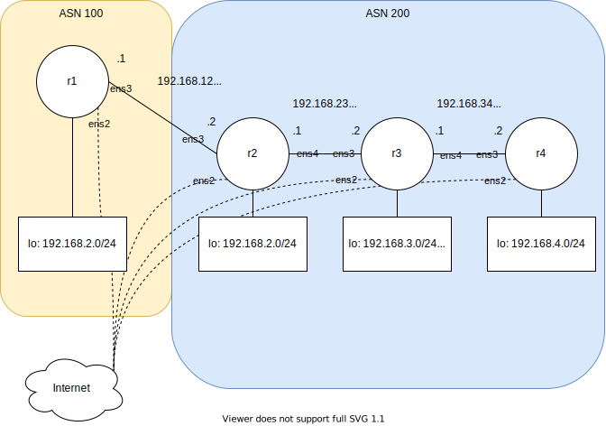

Below is an example of setting up BGP (iBGP and eBGP) using Ubuntu and FRR.


## Links
This post was inspired by [Lab 10 BGP Route Reflection](http://ce.sc.edu/cyberinfra/workshops/Material/BGP/Lab%2010.pdf)

## Versions
Software | Version
--- | ---
Ubuntu | 20.04 (focal)
FRR | 7.5.1

## Diagram



## Setup
This lab requires internet access to download FRR packages. As such, each device's `ens2` is connected to a local host interface (NAT). Setup is out of scope for this lab and depends on your local virtualization environment.

### Certificates
If certificates are required to access the internet (common in corporate environments), install them.
1. `sudo apt-get install ca-certificates -y`
2. `cd /usr/local/share/ca-certificates/`
3. `sudo wget http://<URL>.crt`
4. `sudo update-ca-certificates`

### Install FRR with Snap
[README](https://github.com/FRRouting/frr/blob/master/snapcraft/README.usage.md)

1. Install *frr* snap
```
sudo snap install frr
```
2. Connect Snap
```
snap connect frr:network-control core:network-control
```
3. Create CLI alias
```
sudo snap alias frr.vtysh vtysh
```


### Install FRR with APT
[README](https://deb.frrouting.org/)

1. Download APT keys
```
curl -s https://deb.frrouting.org/frr/keys.asc | sudo apt-key add -
```
2. Set enviroment variable *FRRVER*
```
FRRVER="frr-7"
```
3. Create new APT `sources.list` file
 ```
echo deb https://deb.frrouting.org/frr $(lsb_release -s -c) $FRRVER | sudo tee -a /etc/apt/sources.list.d/frr.list
```
4. Update and install *frr*
```
sudo apt update && sudo apt install frr frr-pythontools
```
5. Enable *bgp* daemon
```
sed -i 's/bgpd=no/bgpd=yes/g' /etc/frr/daemons
```
6. Restart FRR
```
service frr restart
```

## IPv4 forwarding
Enable IP forwarding so Ubuntu can route traffic through interfaces.

```
sed -i 's/#net.ipv4.ip_forward=1/net.ipv4.ip_forward=1/g' /etc/sysctl.conf
sysctl -p
```

## Configuration

### IP Addresses
Use [Netplan](https://ubuntu.com/blog/ubuntu-bionic-netplan) to configure interface IP addresses.

Modify file (name may vary) `/etc/netplan/50-cloud-init.yaml`

* rtr1
```
network:
    ethernets:
        ens2:
            dhcp4: true
        ens3:
            addresses:
              - 192.168.12.1/30
        lo:
          match:
            name: lo
          addresses:
            - 192.168.1.1/24
    version: 2
```
* rtr2
```
network:
    ethernets:
        ens2:
            dhcp4: true
        ens3:
            addresses:
              - 192.168.12.2/30
        ens4:
            addresses:
              - 192.168.23.1/30
        lo:
          match:
            name: lo
          addresses:
            - 192.168.2.1/24
    version: 2
```
* rtr3
```
network:
    ethernets:
        ens2:
            dhcp4: true
        ens3:
            addresses:
              - 192.168.23.2/30
        ens4:
            addresses:
              - 192.168.34.1/30
        lo:
          match:
            name: lo
          addresses:
            - 192.168.3.1/24
    version: 2
```
* rtr4
```
network:
    ethernets:
        ens2:
            dhcp4: true
        ens3:
            addresses:
              - 192.168.34.2/30
        lo:
          match:
            name: lo
          addresses:
            - 192.168.4.1/24
    version: 2
```

Apply netplan configuration.
```
netplan apply
```

Verify IP addresses.
```
root@r2:/# ip a

1: lo:
    inet 192.168.2.1/24 brd 192.168.2.255 scope global lo
3: ens3:
    inet 192.168.12.2/30 brd 192.168.12.3 scope global ens3
4: ens4:
    inet 192.168.23.1/30 brd 192.168.23.3 scope global ens4
```

### FRR
Enter FRR's CLI configuration mode.
```
vtysh
conf t
```

* rtr2
```
router bgp 200
 neighbor 192.168.23.2 remote-as 200
 !
 address-family ipv4 unicast
  network 192.168.2.0/24
  network 192.168.23.0/30
 exit-address-family
```
* rtr3
```
router bgp 200
 neighbor 192.168.23.1 remote-as 200
 neighbor 192.168.34.2 remote-as 200
 !
 address-family ipv4 unicast
  network 192.168.3.0/24
  network 192.168.23.0/30
  network 192.168.34.0/30
  neighbor 192.168.23.1 route-reflector-client
  neighbor 192.168.34.2 route-reflector-client
 exit-address-family
```
* rtr4
```
router bgp 200
 neighbor 192.168.34.1 remote-as 200
 !
 address-family ipv4 unicast
  network 192.168.4.0/24
  network 192.168.34.0/30
 exit-address-family
```

Save configuration on all devices
```
end
wr
```

### Verify
Check that BGP neighbors are online in *vtysh*.
```
r2# show ip bgp summary

Neighbor        V         AS   MsgRcvd   MsgSent   TblVer  InQ OutQ  Up/Down State/PfxRcd   PfxSnt
192.168.23.2    4        200         6         4        0    0    0 00:00:35            4        2
```

Check learned routes in *vtysh*.
```
r2# show ip bgp

   Network          Next Hop            Metric LocPrf Weight Path
*> 192.168.2.0/24   0.0.0.0                  0         32768 i
*>i192.168.3.0/24   192.168.23.2             0    100      0 i
*>i192.168.4.0/24   192.168.34.2             0    100      0 i
* i192.168.23.0/30  192.168.23.2             0    100      0 i
*>                  0.0.0.0                  0         32768 i
*>i192.168.34.0/30  192.168.23.2             0    100      0 i

Displayed  5 routes and 6 total paths
```

Check installed routes in *vtysh*.
```
r2# show ip route

K>* 0.0.0.0/0 [0/100] via 192.168.255.1, ens2, src 192.168.255.146, 00:52:24
C>* 192.168.2.0/24 is directly connected, lo, 00:52:24
B>* 192.168.3.0/24 [200/0] via 192.168.23.2, ens4, weight 1, 00:04:23
B>  192.168.4.0/24 [200/0] via 192.168.34.2 (recursive), weight 1, 00:04:23
  *                          via 192.168.23.2, ens4, weight 1, 00:04:23
C>* 192.168.12.0/30 is directly connected, ens3, 00:52:24
C>* 192.168.23.0/30 is directly connected, ens4, 00:52:24
B>* 192.168.34.0/30 [200/0] via 192.168.23.2, ens4, weight 1, 00:04:23
C>* 192.168.255.0/24 is directly connected, ens2, 00:52:24
K>* 192.168.255.1/32 [0/100] is directly connected, ens2, 00:52:24
```

Exit *vtysh* with `exit` and check installed operating system routes.
```
root@r2:/# ip r

default via 192.168.255.1 dev ens2 proto dhcp src 192.168.255.146 metric 100
192.168.3.0/24 nhid 20 via 192.168.23.2 dev ens4 proto bgp metric 20
192.168.4.0/24 nhid 23 via 192.168.23.2 dev ens4 proto bgp metric 20
192.168.12.0/30 dev ens3 proto kernel scope link src 192.168.12.2
192.168.23.0/30 dev ens4 proto kernel scope link src 192.168.23.1
192.168.34.0/30 nhid 20 via 192.168.23.2 dev ens4 proto bgp metric 20
192.168.255.0/24 dev ens2 proto kernel scope link src 192.168.255.146
192.168.255.1 dev ens2 proto dhcp scope link src 192.168.255.146 metric 100
```

## TODO
Finish lab from page 22.
