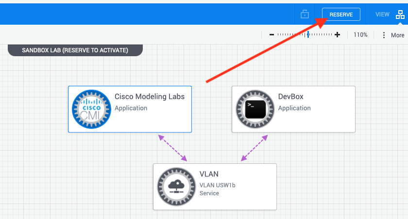

Today we discuss abbreviated instructions to get started with a virtual lab inside Cisco's free Devnet site.
<!-- more -->

## Instructions
1. Login to https://developer.cisco.com
2. Click *sandbox*
3. Under *Explore Technologies* click *Networking*
4. Find *Cisco Modeling Labs Enterprise* and click *Try it out*
5. Click *reserve* to start the lab 
6. Under *Instructions* click *VPN Access* to install Cisco AnyConnect
7. Wait for email with VPN credentials
8. Connect to VPN
9. Under *Instructions* click *Cisco Modeling Labs* for CML information

You're now connected to the CML lab. You can delete and create new topologies as needed.

Hint: Connect virtual routers to your VPN subnet (10.10.20.0/24) using the "external connector" device.
