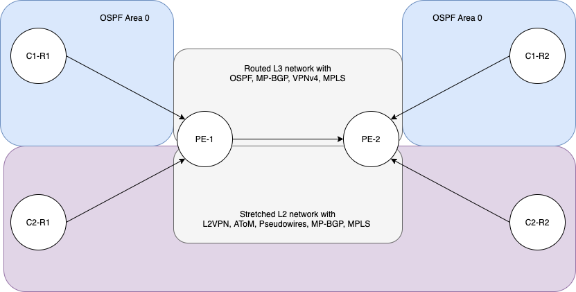

First post talking about network diagrams.


## Markdown
### Image with link
Syntax
```
 [](anchor link)
```
Usage
```
[](https://viewer.diagrams.net/?tags=%7B%7D&highlight=0000ff&edit=_blank&layers=1&nav=1&title=mpls-simple.xml#Uhttps%3A%2F%2Fraw.githubusercontent.com%2Fmartyrsmith%2Fmartyrsmith.github.io%2Fmain%2Fsource%2F_posts%2Fmpls-simple%2Fmpls-simple.xml)
```

https://www.w3schools.io/file/markdown-images/
