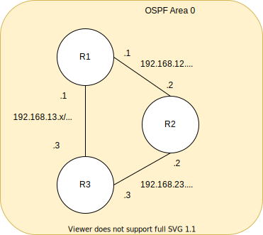

Below we describe how this website is created and updated.

## Hexo

### Setup
* [Setup Docs](https://hexo.io/docs/setup.html)

### Themes
* [Theme Docs](https://hexo.io/docs/themes)

### Markdown image support
* [Hexo-asset-link](https://github.com/liolok/hexo-asset-link)
* [Adding Images to Hexo Posts with Markdown](https://chrismroberts.com/2020/01/06/using-markdown-in-hexo-to-add-images/)

## Github
### Actions
* [Actions docs](https://docs.github.com/en/actions/quickstart)

#### Example
This automatically builds Hexo site from [main] branch and publishes to [gh-pages] brach.

The secret [secrets.GITHUB_TOKEN] is provided by default to the all running jobs.

```
name: Pages

on:
  push:
    branches:
      - main  # default branch

jobs:
  pages:
    runs-on: ubuntu-latest
    steps:
      - uses: actions/checkout@v2
      - name: Use Node.js 12.x
        uses: actions/setup-node@v1
        with:
          node-version: '12.x'
      - name: Cache NPM dependencies
        uses: actions/cache@v2
        with:
          path: node_modules
          key: ${{ runner.OS }}-npm-cache
          restore-keys: |
            ${{ runner.OS }}-npm-cache
        - name: Install Dependencies
        run: npm install
      - name: Build
        run: npm run build
      - name: Deploy
        uses: peaceiris/actions-gh-pages@v3
        with:
          github_token: ${{ secrets.GITHUB_TOKEN }}
          publish_dir: ./docs
          publish_branch: gh-pages  # deploying branch
          cname: dbnservers.net

```

### Pages
* [Pages docs](https://pages.github.com/)
* Configure to watch branch [gh-pages] root [/root] folder.
* Setup a custom domain and SSL

## Diagrams.net
### Create new diagram
* Authenticate with github.
* New diagram
* Select [repo]
* Select [branch]
* Navigate to post folder [source/_posts/how-its-made]
* Name [example.drawio]

### Export as SVG
* File, Export as, SVG
* Select [repo]
* Select [branch]
* Navigate to post folder [source/_posts/how-its-made]
* Name [example.drawio.svg]


## Markdown
[Cheatsheet](https://enterprise.github.com/downloads/en/markdown-cheatsheet.pdf)

### Image with link
#### Syntax

```
 [](anchor link)
```
#### Usage

```
[](https://viewer.diagrams.net/?tags=%7B%7D&highlight=0000ff&edit=_blank&layers=1&nav=1&title=example.drawio#Uhttps%3A%2F%2Fraw.githubusercontent.com%2Fmartyrsmith%2Fmartyrsmith.github.io%2Fhow-its-made%2Fsource%2F_posts%2Fhow-its-made%2Fexample.drawio)
```
#### Example
PNG
[](https://viewer.diagrams.net/?tags=%7B%7D&highlight=0000ff&edit=_blank&layers=1&nav=1&title=example.drawio#Uhttps%3A%2F%2Fraw.githubusercontent.com%2Fmartyrsmith%2Fmartyrsmith.github.io%2Fhow-its-made%2Fsource%2F_posts%2Fhow-its-made%2Fexample.drawio)

SVG
[](https://viewer.diagrams.net/?tags=%7B%7D&highlight=0000ff&edit=_blank&layers=1&nav=1&title=example.drawio#Uhttps%3A%2F%2Fraw.githubusercontent.com%2Fmartyrsmith%2Fmartyrsmith.github.io%2Fhow-its-made%2Fsource%2F_posts%2Fhow-its-made%2Fexample.drawio)
