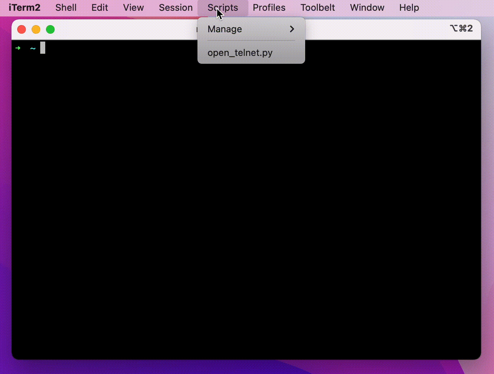

Python script for iTerm that opens telnet sessions in new tabs.
<!-- more -->

## Overview
A simple Python script that opens telnet sessions to multiple routers. This makes it faster to work with [Cisco CML](https://www.cisco.com/c/en/us/products/cloud-systems-management/modeling-labs/index.html) and associated [breakout tool](https://developer.cisco.com/docs/modeling-labs/#!using-breakout-tool). It uses iTerm's built in [Python API](https://iterm2.com/python-api/tutorial/example.html).  

The example below opens a new tab, then issues `telnet localhost {i}` command for all even numbered ports (9000 - 9026). This matches the default port assigned to Cisco IOSv devices.

## Demonstration


## Code
```Python
#!/usr/bin/env python3.7

import iterm2
# This script was created with the "basic" environment which does not support adding dependencies
# with pip.

async def main(connection):
    # Your code goes here. Here's a bit of example code that adds a tab to the current window:
    app = await iterm2.async_get_app(connection)
    window = app.current_terminal_window
    if window is not None:

        for i in range(9000,9028, 2):
            await window.async_create_tab()
            # Get the active session in this tab
            session = app.current_terminal_window.current_tab.current_session
            # Send text to the session as though the user had typed it
            await session.async_send_text(f'telnet localhost {i}\n')

    else:
        # You can view this message in the script console.
        print("No current window")

iterm2.run_until_complete(main)

```
